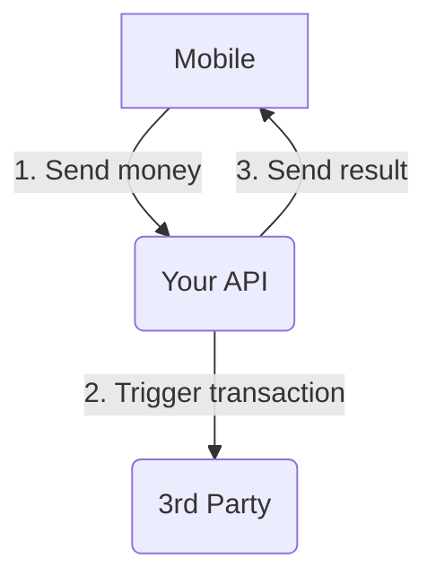

# Djamo's take-home test for API Software Engineer candidates

The goal of this test is to be a _work sample_. Instead of asking you to solve a quizz, implement fizzbuzz or a binary tree search, we would like you to work on something similar to our work. A very common task at Djamo is to integrate with third parties, and while we try to keep our services highly available, fast and reliable, unfortunately we often face issues with our partners.

However, it is Djamo's mission to bring the best experience to our customers. That means it is our duty to handle cleanly all of these errors, so that from a user perspective it looks like everything went fine. This test will give you a glimpse of the issues we can face with 3rd parties.

## Context



You're tasked to developed an API. A mobile application will call your API, and in turn you'll have to call an external service. If the transfer worked, you'll have to notify the mobile application of the success, otherwise, of the failure.

### 3rd party's constraints

As mentionned before, our partners have a number issues, and this one has its share:

- it does not return immediatly if it worked, or not
- it takes a long time to answer (up to 10s)
- it is supposed to call you back through a webhook -- but sometimes it doesn't
- it has a status check API -- but they explicitely said they could block our services if we request it too often

### Your constraints

Your API is consumed by a mobile application, and the experience needs to feel pleasant for the user. So you need to:

- return a response as fast as possible
- return the success / failure of the transaction as quickly as possible

Due to poor network connectivity, sometimes the mobile application will re-try to send the same request twice. You must detect it and only handle the request once.

## Structure

You can start the project easily by running `docker-compose up -d`. This will start a mock for the 3rd party service and for the client application. We encourage to take a look at the different READMEs to understand the global picture.

```
.
├── docker-compose.yml
├── README.md
├── client
│   └── README.md
├── thirdpartymock
│   └── README.md
└── your_api
    └── README.md
```

If you want to perform some tests after your docker-compose is up, you can run the following cURL:

```
curl -H 'Content-Type: application/json' -X POST localhost:3100/transaction
```

This will ask the client application to trigger a transaction creation. Which in turn will call your API.
