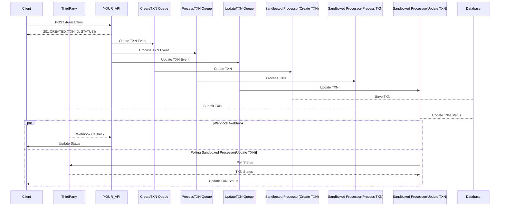

# Transaction Processing API

An example event-driven API service that handles transaction processing with unreliable third-party services.

## Architecture Overview

This API implements an event-driven architecture using BullMQ for message queuing. The stack is written in [TypeScript](https://www.typescriptlang.org/), using [NestJS](https://docs.nestjs.com/) and relying on [Postgres](https://www.postgresql.org/) for persistent storage and [Redis](https://redis.io/) for cache.

It implements the following key components:

- **Producer Service(Fastify HTTP Server)**

  - Handles incoming API requests
  - POST(/transaction) Initiates transaction event sequence **Events**

    ```mermaid
      stateDiagram-v2
          CreateTransaction --> ProcessTransaction
          ProcessTransaction -->UpdateTransaction
    ```

- **Consumer Service**
  - Handles _Create Transaction_ events
  - Handles _Processes Transaction_ events
  - Handles _Update Transaction_ events
  - Registers Message Queues For Each Event Type
  - Registers Sandboxed Workers
- **Sandboxed Workers**
  - Uses Exponential Backoff strategy by default
  - Workers run jobs outside the main process
  - They can be deployed independently
- **Redis** - For message queuing and caching
- **PostgreSQL** - For persistent transaction storage
- **Docker** - For Containerisation

### Sequence Diagram



### Implementation Approach

The design makes use of the event-driven architecture with a message producer service and a consumer service. It will also allow the producer and consumer to be deployed separately, allowing them to scale as needed.

The transactions are processed in worker queues, using sandboxed processes run in a separate process to allow for scale. They are also designed to be standalone, so that they can be deployed and invoked elsewhere (eg. From AWS as a [lambda](https://docs.aws.amazon.com/lambda/latest/dg/getting-started.html)).

The Event-driven architecture leverages a message queue provider [Bullmq](https://github.com/taskforcesh/bullmq). The producer service is a [Fastify](https://github.com/fastify/fastify) http server which creates the jobs.

### Initial Breakdown of Project Requirements

- Create transaction post endpoint:
  - endpoint will accept body with transaction id(idempotent)
  - endpoint will respond with accept immediately once it creates the events below
  - transaction creation events (with retry mechanism)
    - dispatch event to create the transaction in the db
    - dispatch event to create the transaction at third party.
    - dispatch event to update transaction status locally(exponential backoff)
    - dispatch event to update transaction status in client
- Create Transaction in Database event handler:
  - handler will create transaction if not exist.
  - handler will not create duplicate if transaction exists.
- Create Transaction in Third party event handler
  - Handler will check third party if transaction exists(not implemented in third party code)
  - Handler will create transaction in third party
  - Handler will retry if 504: (check exists for transaction existing)
  - Handler will retry creation (3) times (backoff 120s)
  - Handler will fail creation and update transaction status locally accordingly
- Update Transaction status locally event handler:
  - Handler will poll third party for transaction details if:
    - Webhook handler has not returned an update.
    - Handler will poll third party API(because webhook may not be triggered) at:
      - 200ms - if no status, dispatch Update Transaction status event with default status(pending)
      - 10ms
      - exponentially increasing time afterwards(to avoid too many requests)
  - Handler will succeed and stop if:
    - Cancelled by webhook endpoint
    - If transaction status is obtained from third party.
    - After a specified max amount of time
- Update Transaction status in client event handler:
  - call the client transaction endpoint to update transaction status.
- Create webhook endpoint:
  - endpoint will accept body with transaction id and status
  - endpoint will complete the Update transaction status locally event.

#### Key Design Decisions

1. **Event-Driven Architecture**
   - Decouples transaction submission from processing
   - Enables better scaling and resilience
   - Uses BullMQ for reliable message queuing
2. **Sandboxed Processing**
   - Workers run in separate processes
   - Prevents memory leaks
   - Enables independent scaling
3. **Dual Status Update Strategy**
   - Immediate feedback on transaction creation
   - Webhook endpoint for thirdparty updates
   - Fallback transaction notification polling with exponential backoff

#### Error Handling

- Transaction Idempotency through transaction IDs
- Immediate API feedback to the client
- Event processing is done outside the http transaction endpoint
- Http transaction endpoint resolve in less than 20ms
- Thirdparty api calls for updates is done using a backoff strategy
- Exponential backoff polling strategy prevents too many calls to thirdparty
- Graceful handling of third-party timeouts
- Automatic retry mechanisms for failed requests

#### Known Limitations & Future Improvements

1. **Current Limitations**
   - No authentication on webhook endpoint
   - Basic CORS and Http Server Security configuration
   - Limited error reporting and Logging
   - Webhook endpoint accepts any status - there should be a status progression order
2. **Potential Improvements**
   - Add webhook authentication
   - Add status progression order
   - Add more security config to server and consumer(authz, authn, cors, ...)
   - Implement comprehensive monitoring
   - Enhanced error reporting
   - CI CD process
   - Test Coverage
   - Deployment Pipeline
   - KMS Environment Management

### Setup & Deployment

#### Prerequisites

- Docker
- Docker Compose
- Node.js 20+ (NestJs, Fastify)
- Pnpm
- Redis
- PostgreSQL

#### Environment Variables

Create a `.env.`[`local`, `test`, `development`] file Rely on deployment process for environment config in production. A sample `.env.example` file is provided with some sensible defaults. You can duplicate this file, using it as a base for your environment's config

#### Quick Start

```txt

# Start all services
pnpm docker:compose:up
```

```curl
# Test the API
curl -H 'Content-Type: application/json' -X POST localhost:3100/transaction
```

#### Visualize Message Queue in Development

The Consumer API provides a user interface to see the queues and workers in action. Visit <http://localhost:3200/bull-board> to access this interface in development. Replace URL port if you're using a custom port.

#### Local Development(Without Docker)

For local development your need to:

- Setup your environment - You can clone the `.env.example` file to get started
- Start the **Redis** service
- Start your **Postgres** database service
- Create a database in postgres
- Start the client API
- Start the thirdparty API
- Start the your_api development server

```bash

# Create Database
createdb <DB NAME>
```

```bash

# Run Migrations
pnpm use your_api typeorm migration:run
```

```bash

# Stop Docker Containers
pnpm pnpm docker:compose:down
```

```bash

# Start Client API
pnpm use client start
```

```bash
# Start Thirdparty API
pnpm use thirdparty start
```

```bash

# Start Your API Development Server
pnpm use your_api start:dev
```

#### Testing Guide

This project uses **Jest** for testing. _E2E_ and Controller _Unit_ tests are included.

The E2E tests requires the consumer, client and the thirdparty service to be running. It also requires the database and environment to be setup (See the Local Development section).

```bash

# Run Unit Tests
pnpm test
```

```bash

# Stop Docker Services
pnpm pnpm docker:compose:down

# Build project
pnpm build

# Run Migrations
pnpm use your_api typeorm migration:run

# Start Client API Service
pnpm use client start

# Start Thirdparty API Service
pnpm use thirdparty start

# Start Your API Consumer Service
pnpm use your_api start:consumer

# Run E2E tests
pnpm test:e2e
```

#### Consumer API Documentation

**POST** _/transaction_ Creates a new transaction

**Request**(body):

```json
{ "id": "1867613e-b159-4957-857a-00b38efb0e91" }
```

**Response**: Created: (_201 Created_) Exists: (_200 OK_)

```json
{ "id": "1867613e-b159-4957-857a-00b38efb0e91", "status": "pending" }
```

**POST** _/webhook_ Receives status updates from Thirdparty Service

**Request**(body):

```json
**pending**

{ "id": "1867613e-b159-4957-857a-00b38efb0e91", "status": "pending" }

**completed**

{ "id": "1867613e-b159-4957-857a-00b38efb0e91", "status": "completed" }

**declined**

{ "id": "1867613e-b159-4957-857a-00b38efb0e91", "status": "declined" }
```

**Response**: Created: (_201 Created_) Exists: (_200 OK_)

```json
{ "id": "1867613e-b159-4957-857a-00b38efb0e91", "status": "pending" }
```

#### Contributing

Send in a PR
